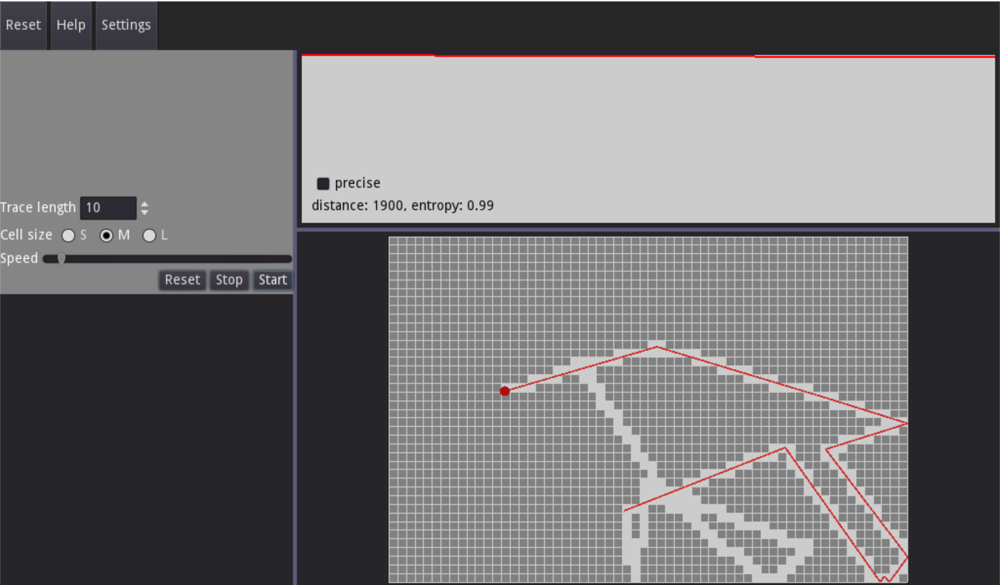
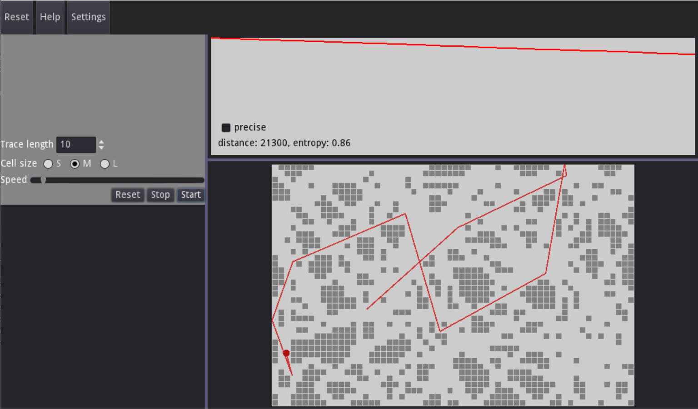

### brownian-motion-search
Визуализация случайного поиска на плоскости в виде броуновского движения с помощью Godot Engine

#### Настраиваемые параметры симуляции:
+ размер ячейки поля
+ длина прыжка частицы
+ скорость движения частицы
+ длина отображаемого следа

#### Скриншоты

  
  

